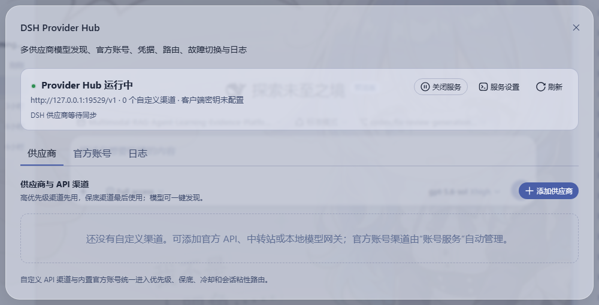
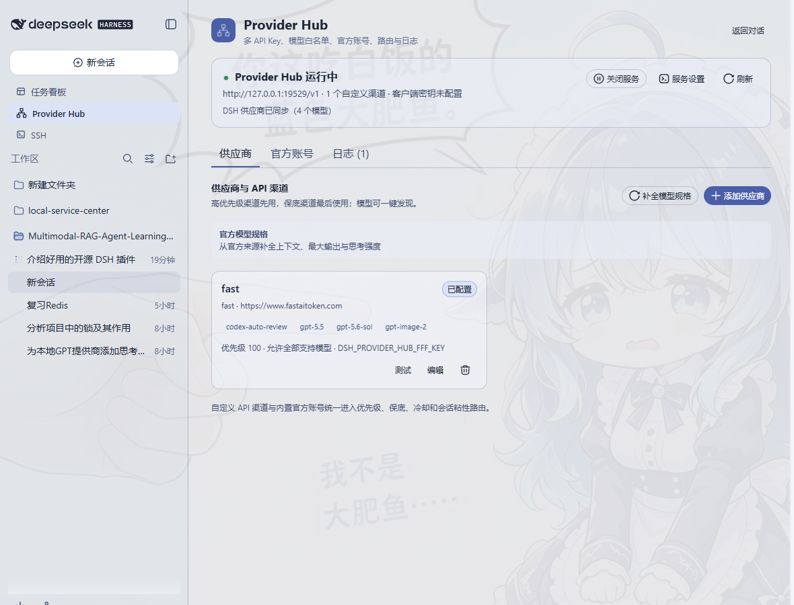
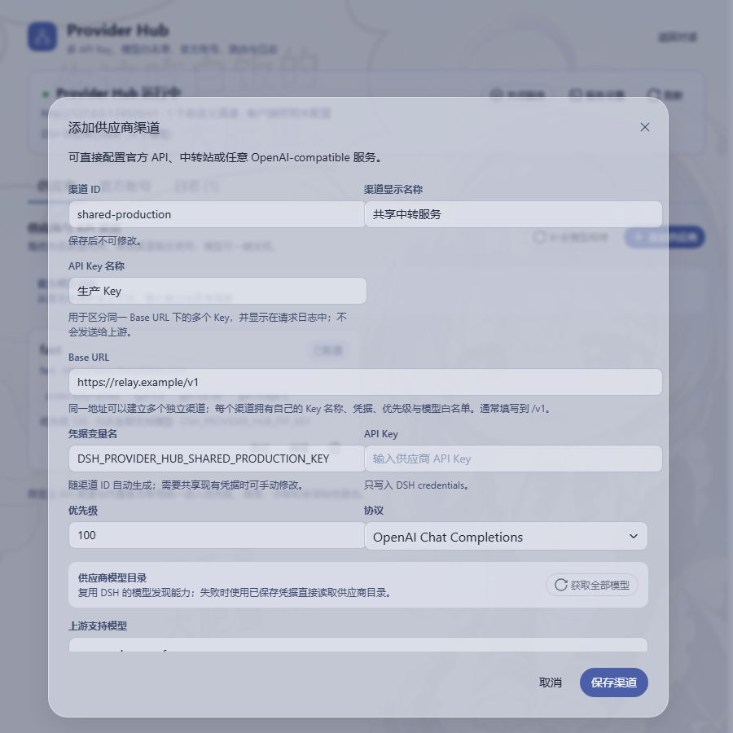
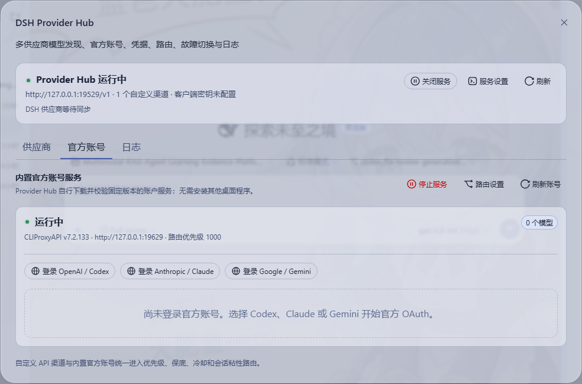

# DSH Provider Hub

`@hewhenjay/dsh-provider-hub` 是面向 DeepSeek Harness（DSH）的独立本地模型服务中心。它把 API Key 渠道、OpenAI-compatible 中转站和 Codex / Claude / Gemini 官方账号放进同一套路由、故障切换与日志界面中。

安装 Provider Hub 不要求安装 Cockpit Desktop，也不会读取、停止或接管已有 Cockpit 服务。官方账号能力由插件自行管理的 loopback sidecar 提供；sidecar 使用上游 CLIProxyAPI 的固定版本，并在首次安装时校验官方 SHA-256。

## 界面预览



页面顶部显示实际 Relay 地址、运行状态和 DSH 供应商同步状态；下方可在 **供应商**、**官方账号** 和 **日志** 之间切换。

## 能力概览

- DSH Web 原生入口：左侧栏按钮与 Settings 页面。
- 内置官方账号服务：OpenAI / Codex、Anthropic / Claude、Google / Gemini 官方 OAuth。
- API Key 渠道：官方 API、中转站、本地网关或其他 OpenAI-compatible 服务。
- 模型发现：优先复用 DSH 自带的一键模型发现，失败时直接读取供应商 `/models`。
- 聚合 OpenAI-compatible API：`/v1/models`、`/v1/chat/completions`、`/v1/responses`。
- 自动接入 DSH Models：服务启动后按实际监听端口创建 `provider-hub` 供应商，并同步聚合模型目录。
- 路由控制：优先级、普通/保底渠道、瞬时故障冷却、最大尝试次数、会话粘性和模型别名。
- 安全凭据：实际密钥写入 DSH credentials；JSON 配置仅保存凭据引用。
- 脱敏日志：只保留渠道、模型、HTTP 状态和延迟，不记录提示词、密钥或完整上游 URL。
- 非侵入端口避让：端口被占用时只选择后续空闲端口，绝不按端口结束其他进程。

## 安装

要求：DSH `0.1.0-rc.6` 或兼容版本、Node.js 20+，以及首次安装内置账号服务时可访问 GitHub Releases。

从 GitHub tag 安装：

```bash
dsh plugin --profile web add github:HeWhenJay/dsh-provider-hub#v0.5.0
```

也可以下载 GitHub release 中的 `hewhenjay-dsh-provider-hub-0.5.0.tgz` 后安装：

```bash
dsh plugin --profile web add ./hewhenjay-dsh-provider-hub-0.5.0.tgz
```

npm 包名已预留为 `@hewhenjay/dsh-provider-hub`，但 v0.5.0 当前以 GitHub tag 和 release 资产为正式发布渠道。Host 与 Web Client 通常在下次安全重启 `dsh web` 后加载。不要为了安装插件停止当前正在承载会话或模型调用的服务；可在方便时重启并刷新 DSH Web 页面。

安装后可从左侧栏底部的 **Provider Hub** 或 **Settings → Provider Hub** 进入。



## 新用户快速上手

安装并安全重启 `dsh web` 后，按下面两种方式任选一种接入模型。已有 Cockpit 或其他 DSH 供应商不会被关闭或替换。

### 方式一：添加 API Key 或中转渠道

1. 点击左侧栏的 **Provider Hub**，确认页面顶部显示“Provider Hub 运行中”。
2. 保持在 **供应商** 标签，点击右上角的 **添加供应商**。
3. 填写渠道 ID、显示名称和 Base URL。OpenAI-compatible 服务通常填写到 `/v1`。
4. API Key 输入实际密钥；“凭据变量名”会随渠道 ID 自动生成。密钥只写入 DSH credentials，不会保存在 `provider-hub.json`。
5. 选择 Chat Completions 或 Responses 协议，点击 **获取全部模型**。确认模型列表后设置优先级；需要最后兜底时勾选保底渠道。
6. 点击 **保存渠道**，回到供应商卡片后点击 **测试**。



图中 API Key 保持为空，仅演示安全的字段填写方式。新渠道的默认凭据引用是 `DSH_PROVIDER_HUB_<CHANNEL_ID>_KEY`：渠道 ID 会转成大写，所有非字母数字字符替换为下划线，例如 `openai-official` → `DSH_PROVIDER_HUB_OPENAI_OFFICIAL_KEY`。

### 方式二：登录官方账号

1. 打开 **Provider Hub → 官方账号**。
2. 如账号服务尚未安装，点击 **安装并启动**；首次安装会下载固定版本并验证官方 SHA-256。
3. 选择 **登录 OpenAI / Codex**、**登录 Anthropic / Claude** 或 **登录 Google / Gemini**。
4. 在浏览器完成官方 OAuth 授权。
5. 返回 DSH；页面会轮询授权状态并自动刷新账号与模型。



账号服务启动后，Provider Hub 会生成一个只存在于运行时的内部渠道。它使用 sidecar 返回的模型目录和账号服务优先级参与统一路由，不会把内部访问密钥返回浏览器，也不会把内部渠道写进 `routes` 配置。

OAuth 使用官方固定的 localhost 回调端口：

| 供应商 | 回调端口 |
|---|---:|
| OpenAI / Codex | 1455 |
| Anthropic / Claude | 54545 |
| Google / Gemini | 8085 |

Provider Hub 只在 `127.0.0.1` 上临时监听对应端口并校验 OAuth state。若端口已被占用，登录会明确失败；插件不会关闭占用者。释放端口后重新发起登录即可。

### 一键补全官方模型规格

渠道或官方账号已经提供模型列表后，可在 **供应商** 标签点击 **补全模型规格**。Provider Hub 会在后台逐个处理支持的模型：

1. 通过 DSH 的联网检索服务查找模型厂商官方文档；
2. 把官方搜索结果交给当前 DSH 默认模型生成严格 JSON；
3. 只接受与模型 ID 对应厂商的官方域名、正整数限制和受支持的思考强度枚举；`thinkingFormat` 还必须与已识别厂商匹配，否则省略该兼容字段；无法可靠识别厂商的自定义别名会跳过；
4. 将验证通过的 `contextWindow`、`maxTokens`、`reasoningEfforts`、兼容配置和来源 URL 写入 `provider-hub.json`；
5. 热同步到自动管理的 `llm-pi-ai.providers.provider-hub`。

按钮点击后任务会静默在 Host 后台运行，页面显示当前模型和进度，可以关闭 Provider Hub 窗口后继续使用 DSH。再次打开页面可查看结果和官方来源。单次最多处理 100 个模型；超长模型 ID、无法识别厂商、没有官方证据、证据不足、模型输出不符合结构或数值不合理时，该模型会被跳过或标记失败，原配置保持不变；插件不会用模型记忆猜测规格。渠道删除模型时会清理对应的孤立规格，研究期间被删除的模型不会写回配置。

这项功能会消耗 DSH 联网检索与当前默认模型的调用额度，因此不会在保存渠道时未经用户点击自动触发。执行补全和配置热同步本身不需要重启 Web。

### 确认模型已自动接入 DSH

保存渠道、完成官方账号登录或补全模型规格后，页面顶部会显示 `DSH 供应商已同步（N 个模型）`。此时打开 DSH 的模型选择器即可看到 `Provider Hub` 提供的模型，无需再手工创建模型供应商。

如果仍显示“等待可用模型”，请先确认渠道的模型列表不为空，或在 **官方账号** 标签点击 **刷新账号**。插件不会自动切换当前会话或默认模型，用户可在模型选择器中自行选择。

## 自动接入 DSH Models 的规则

Provider Hub 默认在 `127.0.0.1:19529` 提供统一接口。服务成功启动且聚合目录至少包含一个模型后，插件会通过 DSH 官方 settings 服务自动创建或更新 `llm-pi-ai.providers.provider-hub`：

- Base URL 使用页面显示的实际地址，包括端口冲突后的自动避让端口；
- API 固定为 OpenAI Chat Completions；
- 模型从 Provider Hub 的聚合 `/v1/models` 目录读取、去重，并尽可能保留名称、上下文窗口和最大输出长度；
- 只有已配置 Provider Hub 客户端访问密钥时才写入对应 `apiKeyEnv`；
- 渠道、官方账号或 sidecar 模型变化后会自动重新同步。

插件只管理 `provider-hub` 这一条供应商，不修改其他供应商，也不会切换 `agent-default-model`。如果用户已经手工创建了同名条目，插件会报告冲突并保持原配置不变。Relay 停止、禁用或聚合模型为空时，插件只删除经自身确认创建的条目；模型为空时状态显示为等待，不写入 DSH 无法使用的空模型供应商。

实际 Base URL 仍会显示在页面顶部，例如：

```text
http://127.0.0.1:19529/v1
```

## 路由规则

对每次请求，Provider Hub 按以下顺序选择渠道：

1. 过滤不能服务该模型的渠道；空模型列表表示允许所有模型。
2. 普通渠道按优先级从高到低排序。
3. 保底渠道按优先级从高到低排在普通渠道之后。
4. 遇到 `408`、`409`、`425`、`429`、`500`、`502`、`503`、`504` 或连接重置时，将渠道暂时冷却。
5. 在 `maxAttempts` 范围内尝试后续渠道。
6. 启用会话粘性时，同一 session 优先复用已成功的健康渠道；失效时自动重选。

内置官方账号渠道默认优先级为 `1000`，可在账号服务设置中修改。它与自定义 API 渠道使用相同排序规则。自定义渠道可标记为保底。

模型别名是“Provider Hub 对外模型 ID → 供应商真实模型 ID”的映射，例如：

```json
{
  "gpt-main": "vendor-gpt-2026-01"
}
```

客户端请求 `gpt-main` 时，该渠道会把模型名改写为 `vendor-gpt-2026-01`。

## 内置账号 sidecar

Provider Hub 当前固定使用：

- 上游项目：[`router-for-me/CLIProxyAPI`](https://github.com/router-for-me/CLIProxyAPI)
- 版本：`v7.2.133`
- 许可证：MIT
- 下载源：该项目的官方 GitHub Release
- 完整性：先下载 `checksums.txt`，再按精确资源名校验 SHA-256

支持 Windows、macOS 和 Linux 的 x64 / arm64。文件位于 `$DSH_HOME/provider-hub/sidecar`：

```text
provider-hub/sidecar/
├─ auth/                  # 官方账号授权文件
├─ bin/7.2.133/           # 已校验的 sidecar 可执行文件
├─ downloads/             # 临时下载目录（成功后清理）
└─ config.yaml            # 仅本机配置
```

安全与生命周期边界：

- 固定监听 `127.0.0.1`；
- 首选端口 `19629`，被占用时最多向后搜索 49 个端口；
- Management API 禁止远程访问，内置控制面板关闭；
- client key 与 management key 随机生成并写入 DSH credentials；
- 插件只保存并终止自己启动的子进程，绝不根据端口查杀进程；
- 下载、安装或启动失败只影响官方账号渠道，不妨碍自定义 API 渠道和 Provider Hub relay 启动。

关闭“未安装时自动下载”后，启动缺失的 sidecar 会显示“未安装”，不会访问网络。仍可在页面中手动点击 **安装并启动**。

## 配置

默认配置文件是 `$DSH_HOME/provider-hub.json`。完整示例见 `config.example.json`：

```json
{
  "provider": "provider-hub",
  "maxAttempts": 6,
  "cooldownMs": 30000,
  "sessionAffinity": true,
  "listen": {
    "enabled": true,
    "host": "127.0.0.1",
    "port": 19529,
    "apiKeyEnv": "DSH_PROVIDER_HUB_CLIENT_KEY"
  },
  "accountService": {
    "enabled": true,
    "autoInstall": true,
    "port": 19629,
    "priority": 1000
  },
  "managedProvider": {
    "enabled": true,
    "id": "provider-hub",
    "displayName": "Provider Hub"
  },
  "routes": []
}
```

环境变量 `DSH_PROVIDER_HUB_CONFIG` 可指定其他配置路径。

### 端口与监听安全

- Relay 默认只监听 `127.0.0.1:19529`。
- sidecar 始终只监听 `127.0.0.1`，首选 `19629`。
- 两者发生端口冲突时都会向后寻找空闲端口，不会关闭原监听器。
- 将 relay 改为 `0.0.0.0` 前必须配置客户端访问密钥，否则服务拒绝启动。
- 不要把 relay 直接暴露到公网；远程使用应配合防火墙、VPN 或带认证的反向代理。

## HTTP 接口

统一 relay：

```text
GET  /health
GET  /v1/models
POST /v1/chat/completions
POST /v1/responses
```

DSH Host 管理接口（供插件 Web UI 使用）：

```text
GET    /api/provider-hub/state
GET    /api/provider-hub/logs
DELETE /api/provider-hub/logs
PUT    /api/provider-hub/service
POST   /api/provider-hub/models/discover
GET    /api/provider-hub/models/research
POST   /api/provider-hub/models/research
POST   /api/provider-hub/routes
DELETE /api/provider-hub/routes/:id
POST   /api/provider-hub/routes/:id/test

GET    /api/provider-hub/account-service
PUT    /api/provider-hub/account-service
POST   /api/provider-hub/account-service/install
POST   /api/provider-hub/account-service/start
POST   /api/provider-hub/account-service/stop
POST   /api/provider-hub/account-service/refresh
POST   /api/provider-hub/account-service/oauth/:provider/start
GET    /api/provider-hub/account-service/oauth/status?state=...
PATCH  /api/provider-hub/account-service/accounts/:id/status
DELETE /api/provider-hub/account-service/accounts/:id
```

管理响应只返回脱敏状态。sidecar client key、management key、供应商 API Key、OAuth token 和账号文件内容不会返回 Web Client。

## 从 DSH Cockpit Relay 迁移

v0.3 更名为 DSH Provider Hub，并从“桥接外部 Cockpit”迁移为独立内置账号服务。

1. 如果 `$DSH_HOME/provider-hub.json` 已存在，直接使用新文件。
2. 否则若 `$DSH_HOME/cockpit-relay.json` 存在，读取旧配置、按新结构规范化并写入 `provider-hub.json`。
3. 旧文件保留，不删除、不覆盖。
4. 旧渠道的凭据引用（例如 `COCKPIT_RELAY_*`）原样保留，因此不会丢失已有 DSH credential。
5. 新建渠道使用 `DSH_PROVIDER_HUB_*` 命名。
6. `/api/cockpit-relay` 暂时作为管理 API 兼容别名保留；新 Web Client 只调用 `/api/provider-hub`。

迁移不会修改当前 DSH 默认模型，也不会接管任何已经监听的 Cockpit 端口。Provider Hub 自 v0.4 起只会新增并管理独立的 `provider-hub` 模型供应商；其他 DSH Models 条目保持不变。

## 故障排查

- **Provider Hub 显示不同端口**：首选端口已占用。使用页面显示的实际 Base URL，不要关闭未知监听器。
- **账号服务安装失败**：确认 GitHub Releases 可访问、DSH Home 可写、系统架构受支持。SHA-256 不匹配时插件会删除下载并拒绝执行。
- **OAuth 无法开始**：固定 localhost 回调端口可能已占用。插件不会抢占；释放相应端口后重试。
- **OAuth 完成后没有模型**：点击 **刷新账号**，检查账号是否停用或暂不可用；也可保留 API Key 渠道作为普通或保底路径。
- **DSH 中没有自动出现 Provider Hub**：确认 relay 正在运行且至少有一个可用模型；零模型时插件会等待，不创建无效供应商。
- **“补全模型规格”不可用**：确认 DSH 已配置可用的默认模型和联网检索服务，并且 Provider Hub 至少支持一个模型。
- **部分模型被跳过**：官方搜索结果没有同时证明上下文窗口和最大输出，或返回的思考强度缺少准确 API wire 值。为避免错误配置，插件不会猜测。
- **补全后是否需要重启**：不需要。规格写入后由 DSH settings 热更新；只有安装或升级 Provider Hub 插件本身时，才需要用户在方便时自行重启 `dsh web`。
- **显示同名供应商冲突**：DSH 已存在非插件创建的 `provider-hub` 条目。插件不会覆盖它；请先在 Models 中改名或删除该条目再刷新 Provider Hub。
- **DSH 无法访问 relay**：使用实际 Base URL；检查 relay 开关与客户端密钥。LAN 模式无密钥时服务会拒绝启动。

## 开发与验证

```bash
npm test
npm pack --dry-run
```

测试覆盖路由优先级、保底与冷却、流式响应、端口避让、凭据不落盘、日志脱敏、模型发现、官方来源模型规格补全与拒绝边界、DSH 供应商同步与冲突保护、账号管理契约、OAuth state 限制、sidecar 资源映射与 checksum 解析、打包边界和浏览器模块注册。

## 许可与第三方组件

Provider Hub 插件代码按仓库 `LICENSE`（CC BY-NC-SA 4.0）发布。设置导航中的 Network 图标来自 [Lucide](https://lucide.dev/icons/network)，按 ISC License 使用。内置账号服务二进制不打进 npm 包；首次使用时从 CLIProxyAPI 官方 Release 下载。CLIProxyAPI 由其作者按 MIT License 发布。使用官方账号、API Key、中转服务和多账号路由时，请遵守对应平台服务条款、账号政策和当地法律。
